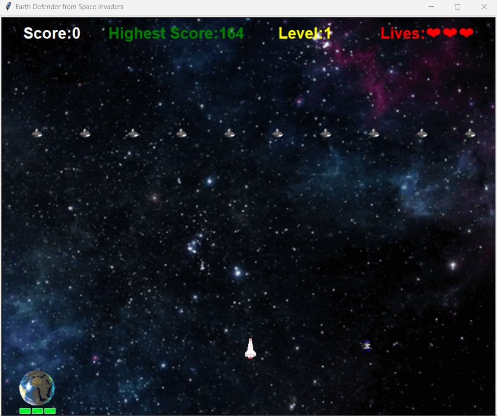
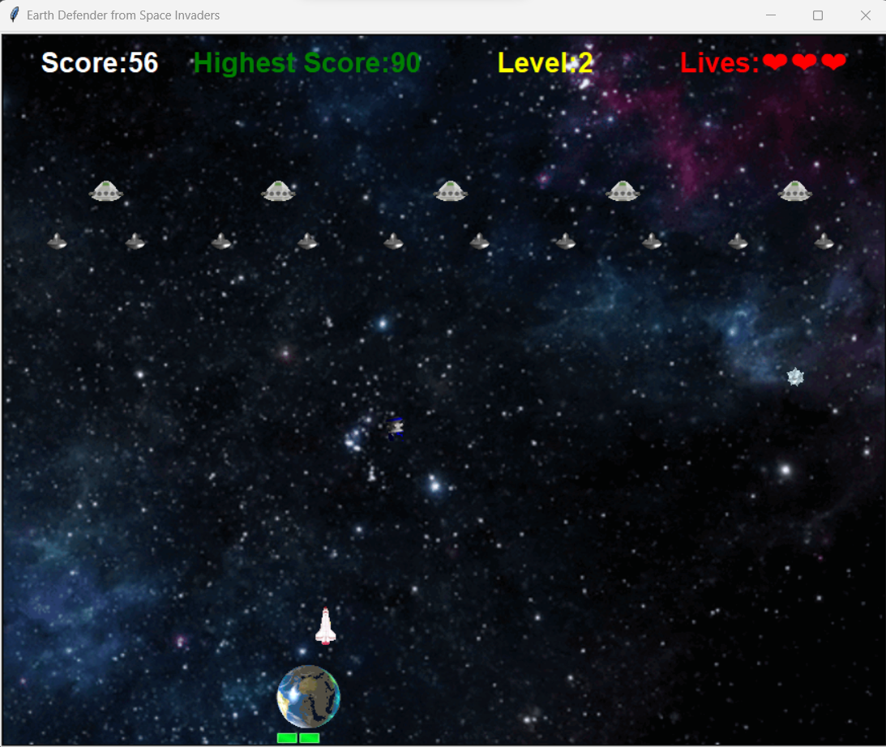
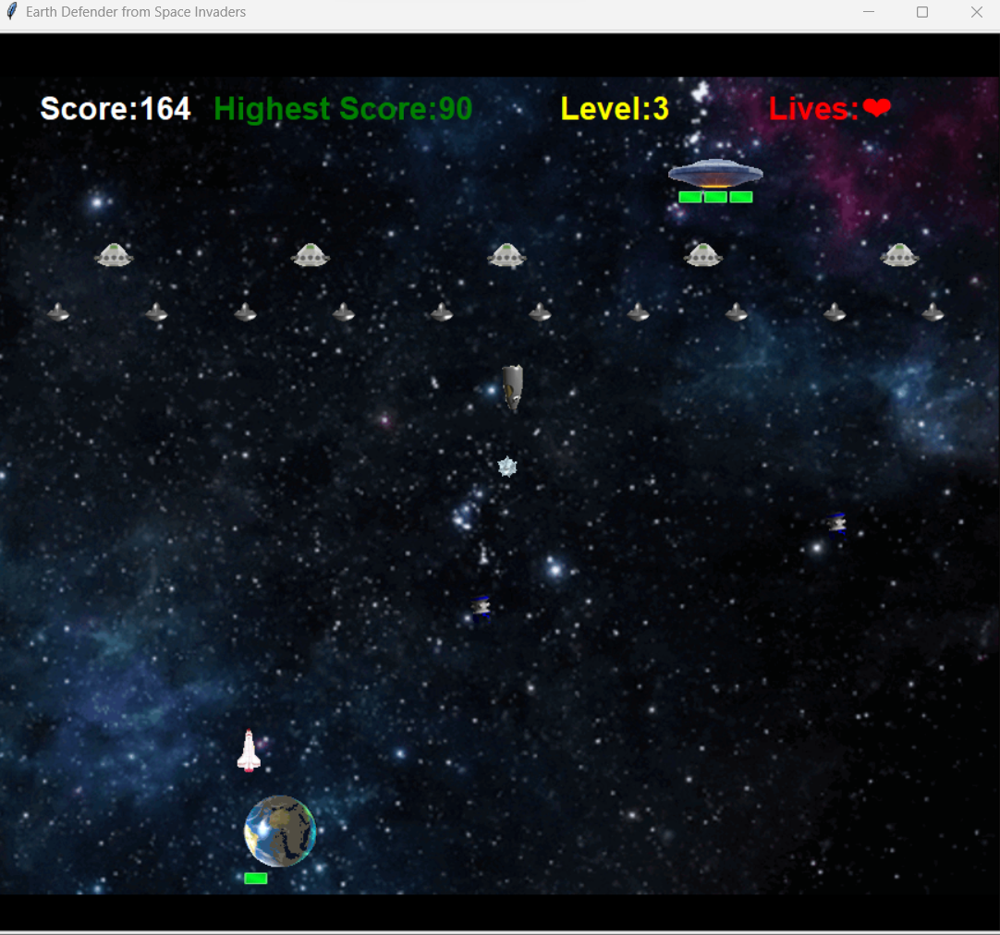
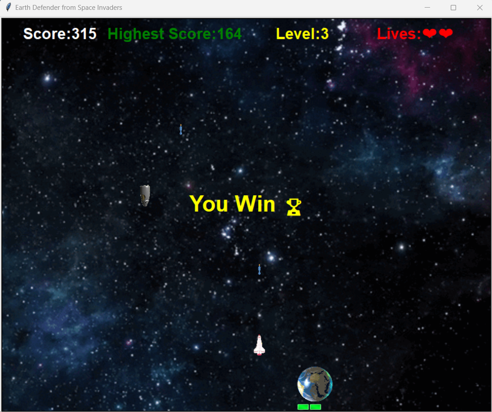

# Space Invaders Game

## Description

Space Invaders is a classic arcade-style game implemented in Python using the Turtle module. In this game, players control a spaceship and must protect Earth from invading soldiers spaceship, generals spaceship, and a boss spaceship. The game has three levels of increasing difficulty, and players need to clear each level to win. The player has three lives and must prevent opponents' bullets from hitting Earth.

## Features

- Player spaceship with three lives.
- Earth with three lives to defend.
- Three game levels: Soldiers (Level 1), Soldiers and Generals (Level 2), and Soldiers, Generals, and the Boss (Level 3).
- Players and opponents can fire bullets.
- Score tracking.
- Lives display.
- High score tracking.
- Game over and victory conditions.

## How to Play

1. Run the `main.py` script to start the game.
2. Use the arrow keys to control the player's spaceship (left, right).
3. Press the spacebar to fire bullets.
4. Shoot down the opponents (soldiers, generals, and the boss) to progress through levels.
5. Protect Earth from being hit by opponent bullets.

## Game Levels

### Level 1: Soldiers
- In this level, players face soldiers as opponents.
- Defeat all soldiers to advance to the next level.

### Level 2: Soldiers and Generals
- In this level, players face both soldiers and generals as opponents.
- Defeat all opponents to advance to the next level.

### Level 3: Soldiers, Generals, and the Boss
- In this final level, players must defeat soldiers, generals, and the boss.
- The boss has three lives and must be defeated to win the game.

## Scoring

- Score is awarded for each opponent defeated.
- Score is also awarded if player missile intercepts the opponents missile.
- Your high score will be recorded.

## Game Over and Victory

- If Earth loses all its lives (Earth's life = 0), the game is over.
- If you clear all three levels, you win the game.

## Requirements

- Python 3.x
- Turtle module (usually included with Python)

## Note:
- The game features a dynamic moving background achieved through threading, which changes frames to create an immersive gaming experience. However, it's important to note that this dynamic background leads to reduction in the game's performance speed. If you desire a faster-paced gaming experience, you can consider removing the dynamic background screen to optimize gameplay speed.

Have fun playing Space Invaders!

## Working of Space Invaders Game:

### Level 1:

### Level 2:

### Level 3:

### Game Won:

### Game Over:
